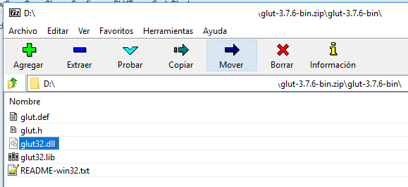
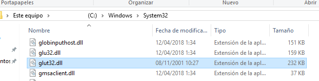
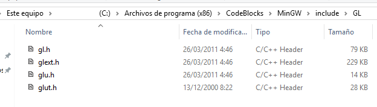
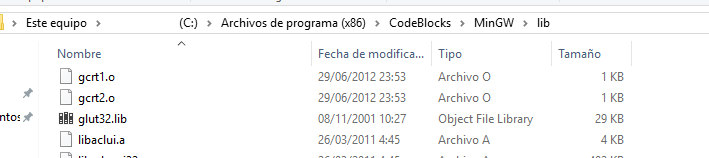
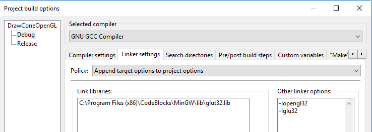

# Drawing cone using openGL GLUT

In this example we draw a cone using opengGl/GLU and also we using idle function for animation. glutSolidCone function is used.

We also add an FPS counter in the window title. you can use a fps limiter funciont or without a limiter function

## Step by step how to use GLUT with Code::Blocks IDE:

-First get glut ZIP

-Copy glut32.dll to Windows/System32 folder

-Copy glut.h to Code::Blocks MinGW/include/GL folder

-Copy glut32.lib to Code::Blocks MinGW/lib/ folder

-Add  library and options (-lopengl32 and -lglu32) to project build options

