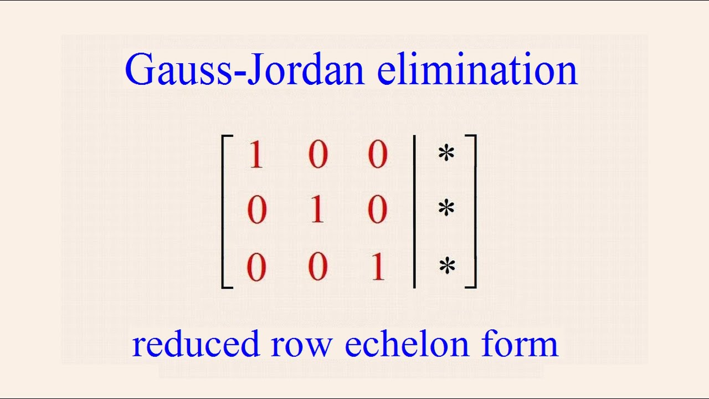

# Gauss-Jordan elimination

In mathematics, the Gauss-Jordan elimination, named in honor of Carl Friedrich Gauss and Wilhelm Jordan is an algorithm of linear
algebra that is used to determine the solutions of a system of linear equations, to find matrices and inverse. A system of equations
is solved by the Gaussian method when its solutions are obtained by reducing the given system to another equivalent in which each
equation has one less unknown than the previous one. The Gaussian method transforms the coefficient matrix into a superior triangular
matrix. The Gauss-Jordan method continues the transformation process until obtaining a diagonal matrix.

Resources:

http://archive.oreilly.com/oreillyschool/courses/data-structures-algorithms/mathematical.html

https://es.wikipedia.org/wiki/Eliminación_de_Gauss-Jordan

https://en.wikipedia.org/wiki/Gaussian_elimination

https://en.wikipedia.org/wiki/Pivot_element

https://www.geeksforgeeks.org/program-check-diagonal-matrix-scalar-matrix/
